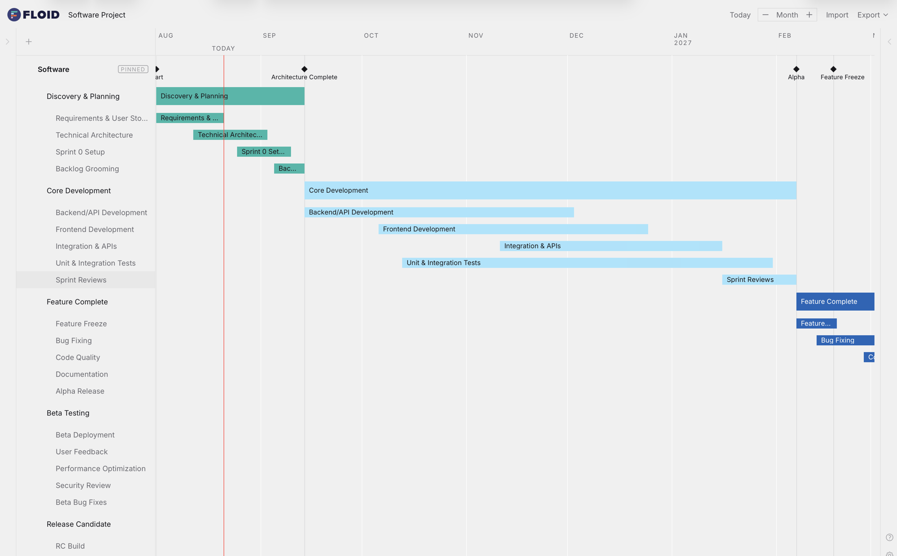

<h1 align="center">FLOID</h1>

<p align="center">
  <strong>Fluid timelines for product development.</strong><br>
  A browser-based visual scheduling tool. Free, no account, nothing leaves your machine.
</p>

<p align="center">
  <a href="https://floid.design/"><strong>floid.design →</strong></a>
</p>

<p align="center">
  
</p>

---

## What it is

FLOID builds product development schedules as a visual timeline. A project holds
several **schedules** — one per team or workstream, say engineering, design,
tooling, marketing — and each schedule holds bars and milestones you arrange by
dragging them.

One schedule can be **pinned**: it renders on top and its milestone lines extend
down through every other schedule, so the dates that matter stay visible across
the whole project.

There are templates for complete product development, engineering, industrial
design, software, and marketing — or start blank.

## The idea

Most Gantt tools model a hierarchy of distinct types: a project has phases, a
phase has tasks, a task has subtasks, each with its own rules and its own editor.
FLOID has one type.

**Everything on the timeline is the same recursive item.** There is no phase
type, no task type, no separate marker type. An item is either a *bar* (spans
days, can hold children) or a *milestone* (a single date). Depth in the tree is
the only difference between a phase and a task — and depth is decided by
dragging. Drop an item onto a bar and it becomes a child; drag it back out to
open space and it doesn't. That is the entire organising model. There is no "add
task" button, because there doesn't need to be one.

Three decisions make that work:

**Positions are absolute.** Every item stores its own `start` and `end` as day
keys (`'yyyy-MM-dd'`), never an offset from its parent. So re-parenting doesn't
move anything — an item dropped into another bar, or another schedule entirely,
lands on exactly the pixel it left. It also deletes every rescale path a relative
model would need.

**Aim is not intent.** Dropping onto a *bar* gives a delta of zero: reaching that
bar meant travelling to wherever it already sits, so the item keeps its dates.
Dropping onto a *row* does move the dates, because a row spans the full width, so
where you let go along it really was a choice.

**Colour is resolved, not stored.** `color: null` means inherit — a root bar
takes the schedule's palette, a nested bar takes its parent's. Nothing
auto-assigns a colour, so an explicit one always means someone picked it, and
reordering root bars reflows the palette underneath.

## The look

Flat ink on one sheet of paper. FLOID is a printed Gantt chart, not a dashboard.

There is one ground colour and no cards, panels, or bordered containers anywhere
in the app body. There are no horizontal row rules — separation is whitespace.
Vertical gridlines are *white*, lighter than the ground, so they read as gaps in
the paper rather than lines drawn on it. Bars are square, flat, and carry
`mix-blend-mode: multiply`, so overlaps darken like overprinted ink. Affordances
— chevrons, drag grips, add buttons — stay invisible until you hover the row, so
a full project looks as calm as an empty one.

The full rules live in [`CLAUDE.md`](CLAUDE.md); the palette and assets are in
[`BRAND.md`](BRAND.md).

## Your data stays yours

There is no backend, no account, and no database. Projects live in your browser's
IndexedDB. You can optionally point FLOID at a local folder and it will autosave
there via the File System Access API.

Export formats:

| Format | Contents |
|--------|----------|
| `.floid` | A single schedule, for sharing |
| `.floid-project` | A full project backup |
| `.png` | The rendered timeline |

## Running it

```bash
npm install
npm run dev        # localhost:3000
```

Other scripts:

```bash
npm run build      # production build
npm run preview    # preview the build
npm run test       # vitest
npm run typecheck  # tsc --noEmit
npm run lint       # eslint
```

## Layout

```
src/
├── components/
│   ├── timeline/   Timeline, rows, bars, milestones, grid
│   ├── layout/     Header, sidebars, modals
│   ├── panels/     Schedule and item editors
│   └── common/     Buttons, inputs, dialogs
├── stores/         Zustand: project, section, ui, sync
├── hooks/          useItemDrag, useCreateGhost, useTimelinePan, …
├── utils/          itemTree, dayKeys, timelineUtils, migrateLegacy, …
├── data/           Schedule and project templates
└── types/          timeline.ts (the model), legacy.ts (what it replaced)
```

Two files carry most of the weight: **`utils/itemTree.ts`** holds every
structural tree operation, and **`flattenSection`** in `utils/timelineUtils.ts`
turns a schedule into the rows it draws. Both columns, keyboard navigation, and
the PNG exporter all walk that same flattened list, so they can't disagree about
what's on screen.

## Built with

React 18 · TypeScript (strict) · Vite · Zustand · TailwindCSS · date-fns · Vitest

## Status

Actively developed. Published so the code can be read — see
[LICENSE](LICENSE) for what you may and may not do with it. Issues and
observations are welcome; feature contributions probably aren't, since this
tracks a fairly specific design intent.

Questions: [support@floid.design](mailto:support@floid.design)
